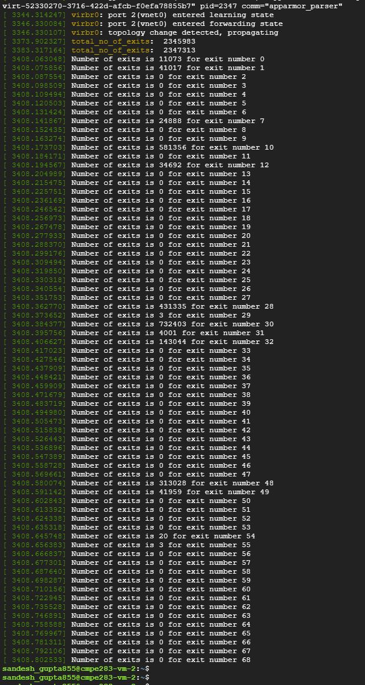
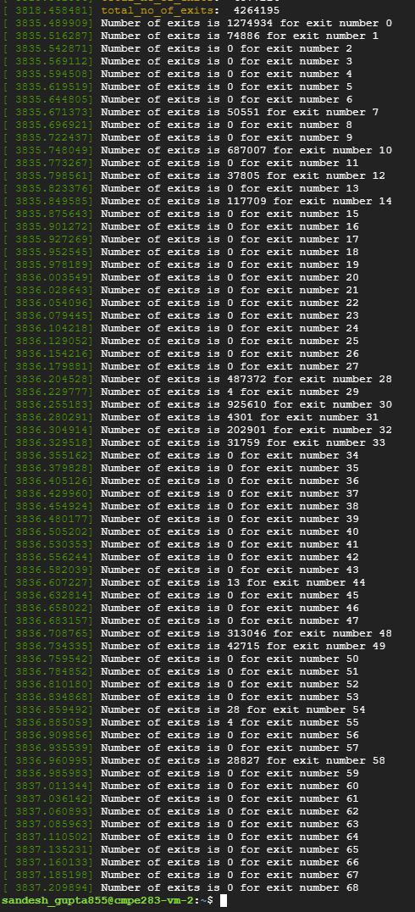

# Assignment 4

### Question 1 

Did by myself
 
### Steps followed

- Run assignment 3 code and boot a test VM using that code.
- Once the VM has booted, record total exit count information (total count for each type of exit handled by KVM). Use the commands 
```
cpuid -l 0x4fffffff -- total count
for i in `seq 0 69`; do cpuid -l 0x4ffffffd -s $i; done -- for specific exit counts
```
- Shutdown your test (inner) VM.
- Remove the ‘kvm-intel’ module from your running kernel: 
```sudo rmmod kvm-intel```
- Reload the kvm-intel module with the parameter ept=0 (this will disable nested paging and force KVM to use shadow paging instead)
``` sudo insmod /lib/modules/5.18.0-rc3+/kernel/arch/x86/kvm/kvm-intel.ko ept=0 ```
-  Boot the same test VM again, and capture the same output as you did in step 2.


### Sample - print exit counts

| With EPT  | Without EPT |
| ------------- | ------------- |
|    |     |

### Observations

- What did you learn from the count of exits? Was the count what you expected? If not, why not?

--> The number of exits almost doubled in case of shadow paging compared to nested paging. It was expected because of the increase in page faults and TLB invalidations.

- What changed between the two runs (ept vs no-ept)?

--> Saw a drastic increase in number of exit type 0 (NMI) from 11073 vs 1274934 after changing ept config. The count for exit 14 - NVLPG, 33 - VM-entry failure due to invalid guest state,  and 58 - INVPCID shot up from 0 to  117709, 31759 28827 respectively. This affirms the expectations from the above question.
