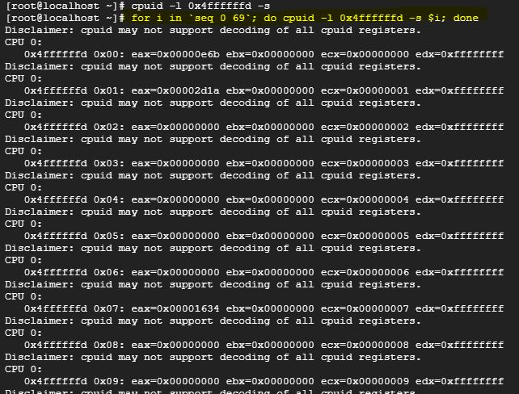
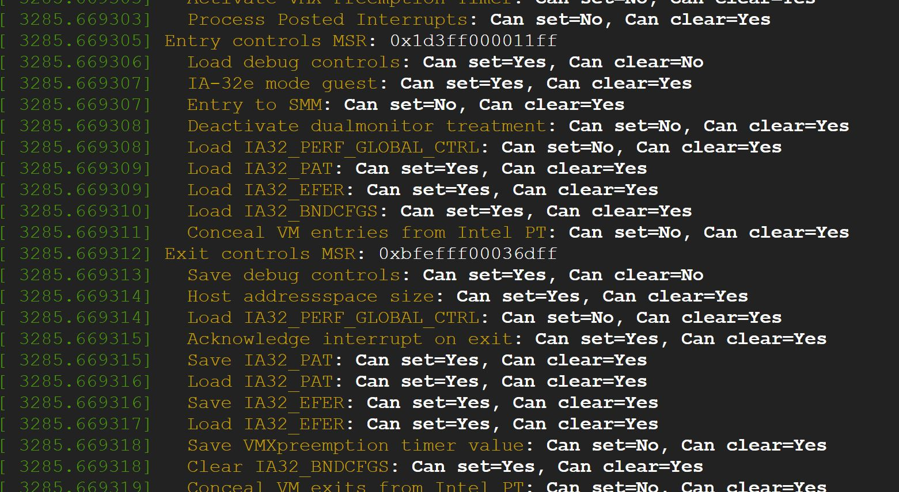
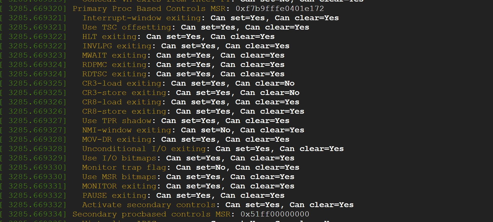
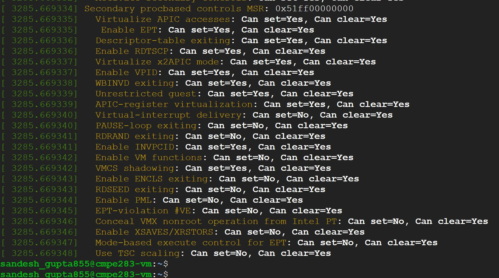

# Assignment 3

### Question 1 

Did by myself
 
### Question 2 - Steps followed

- Use code from assignment 2 as base code
- Added code in vmx.c and cpuid.c to implement the functionality for eax= 0x4FFFFFFD and 0x4FFFFFFC
- `make -j 8 modules`
- `sudo bash`
- `make INSTALL_MOD_STRIP=1 modules_install && make install`
- `lsmod | grep kvm`
- `rmmod kvm_intel; rmmod kvm`
- `modprobe kvm_intel; modprobe kvm`

#### Testing 

- Start nested vm - CentOS

```
sudo virsh start centOSvm

sudo virsh console centOSvm
```
- Install cpuid in L1 VM

`sudo yum -y install cpuid `

- Run cpu commands

```
cpuid -l 0x4ffffffd -s <exit_number>
cpuid -l 0x4ffffffc -s <exit_number>

for i in `seq 0 69`; do cpuid -l 0x4ffffffd -s $i; done -- for all exit counts

```

#### Obsevations

- Comment on the frequency of exits – does the number of exits increase at a stable rate? Or are there 
more exits performed during certain VM operations? Approximately how many exits does a full VM 
boot entail?

--> Full boot caused approximately 700k exits. The increase in number of exits were pretty much stable when queried within 5-10 seconds and no operations were being performed (Ref1 and Ref2). The exits tend to increase at a faster rate when you run multiple commands(top, ping, du) and work with it.

- Of the exit types defined in the SDM, which are the most frequent? Least?

--> Some of the exits which were least(0) were: 2 - Triple Fault, 3 - INIT signal, 4 - SIPI, 6 - Other SMI
Some of the most frequent exits were: 10 - CPUID, 28 - Control register access, 30 - I/O instruction , 48 - EPT violation (Ref1 and [](https://github.com/sandeshgupta/linux/blob/master/cmpe283/output/specific_exits_2.JPG) )

# Assignment 2

### Question 1 

Did by myself
 
### Question 2 - Steps followed

- Use code from assignment 1 as base code
- Added code in vmx.c and cpuid.c to implement the functionality for eax= 0x4FFFFFFF and 0x4FFFFFFE
- `make -j 8  modules`
- `sudo bash`
- `make INSTALL_MOD_STRIP=1 modules_install && make install`
- `lsmod | grep kvm`
- `rmmod kvm_intel; rmmod kvm`
- `modprobe kvm_intel; modprobe kvm`

#### Testing 

- Create nested vm - CentOS

```
wget "http://mirrors.greenmountainaccess.net/centos/7.9.2009/isos/x86_64/CentOS-7-x86_64-DVD-2009.iso"

sudo apt-get install qemu-kvm libvirt-daemon-system libvirt-clients bridge-utils

virt-install  --network bridge:virbr0 --name centOSvm --os-variant=centos7.0 --ram=1024 --vcpus=1 --disk path=/var/lib/libvirt/images/centOSvm-os.qcow2,format=qcow2,bus=virtio,size=5 --graphics none  --location=CentOS-7-x86_64-DVD-2009.iso --extra-args="console=tty0 console=ttyS0,115200"  --check all=off

sudo virsh start centOSvm

sudo virsh console centOSvm
```
- Install cpuid in L1 VM

`sudo yum -y install cpuid `

- Run cpu commands

```
cpuid -l 0x4fffffff
cpuid -l 0x4ffffffe
```


# Assignment 1

### Question 1 

Did by myself
 
### Question 2 - Steps followed

- Configure GCP VM instance
- Install `build_essential`, `gcc` and `make` 
- Clone the repo `torvals/linux` in VM
- Upload cmpe283.c and Makefile file to VM
- `make menuconfig`
- `make oldconfig`
- `make prepare`
- `make -j 8`
- `sudo make INSTALL_MOD_STRIP=1 modules_install`
- `sudo make install`
- `sudo reboot`
- `uname -a`
- `make`
- Add the licence info in c file and save
- `make`
- `sudo insmod cmpe283-1.ko`
- `dmesg`
- Update the code to get Entry, Exit, Primary, Secondary controls
- `make; sudo rmmmod cmpe283-1`
- `sudo insmod cmpe283-1.ko`
- `dmesg`
- Push the changed files and the output images to repo

### Output

1. Entry and Exit



2. Primary



3. Secondary


